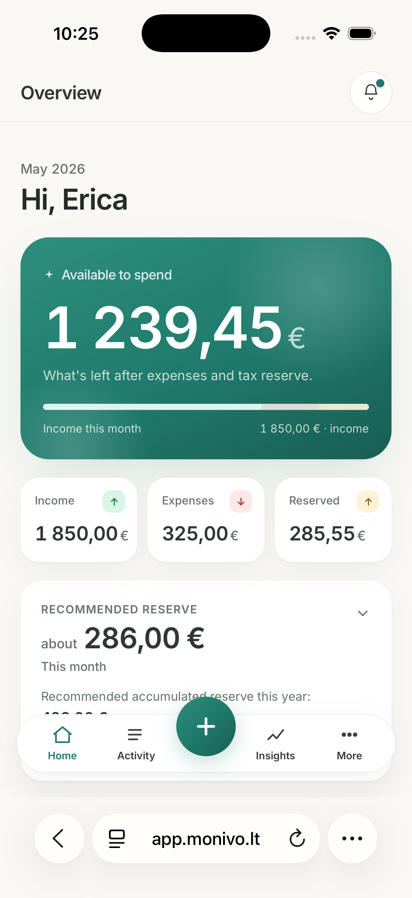
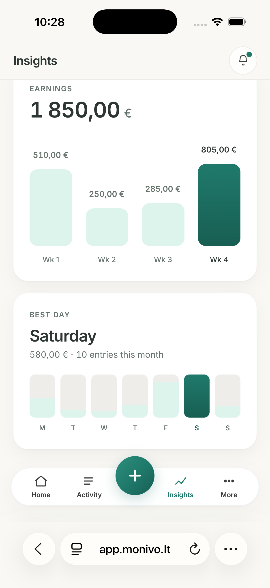
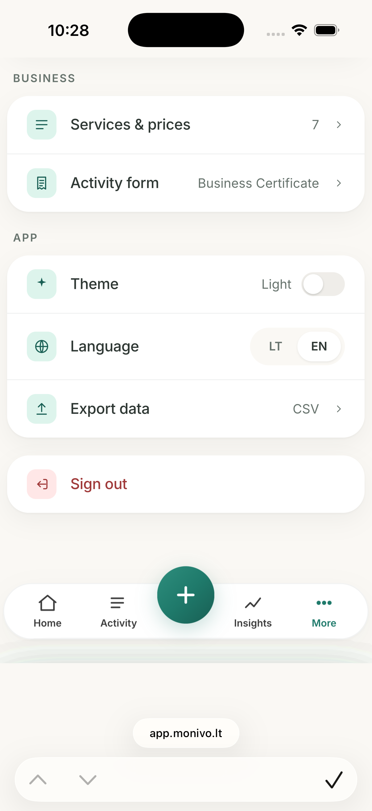

<div align="center">

# Monivo

**Pagaliau aišku, kiek lieka.** *(Finally clear how much is left.)*

A mobile-first SaaS that helps self-employed beauty professionals in Lithuania track income, expenses, and taxes — and see, in one number, how much money they can actually spend.

[](https://app.monivo.lt)
[](https://monivo.lt)
[](https://nextjs.org/)
[](https://react.dev/)
[](https://www.typescriptlang.org/)
[](https://tailwindcss.com/)
[](https://supabase.com/)
[](https://vercel.com/)

</div>

---

## The Problem

Self-employed beauty professionals — nail technicians, hairdressers, lash and brow artists, cosmetologists — run real businesses, but they are not accountants and they don't want to be.

Day to day they struggle with the same things:

- **Money comes in fragments** — cash, card, and bank transfers across many small appointments, easy to lose track of.
- **Taxes are an afterthought** — money owed to the state sits in the same account as spendable money, so the year-end bill is a nasty surprise.
- **Accounting tools are overkill** — chart-of-accounts software, ERPs, and bookkeeping apps speak a language they don't, and they create anxiety instead of clarity.
- **The real question is never answered** — *"How much of this money is actually mine to spend?"*

## Solution

Monivo is a **clarity tool, not accounting software.** It answers one question better than any chart: **how much can I spend today?**

- Log a sale or an expense in **under 10 seconds**, one-handed, on a phone between clients.
- Monivo automatically **reserves money for taxes** based on the user's activity type.
- The dashboard shows a single, calm **spendable number** — income minus expenses minus the tax reserve.

Lithuanian-first, friendly, and designed to reduce financial anxiety rather than add to it.

## Features

- **💶 Income tracking** — fast quick-add with service presets and payment method (cash / card / transfer).
- **🧾 Expense tracking** — low-friction logging with simple, human categories (supplies, rent, marketing, education, equipment, other).
- **✂️ Service management** — create, edit, reorder, and price the services offered, used as one-tap presets when logging income.
- **🛡️ Tax reserve calculator** — supports Lithuanian self-employment activity forms (**Individuali veikla**, **Verslo liudijimas**, or a custom percentage), automatically setting aside what's owed.
- **📊 Business insights** — weekly earnings, best day of the week, and top-performing services.
- **📤 CSV export** — export income, expenses, or both, by month / year / custom range, with Excel-friendly UTF-8 output.
- **⏳ Free trial system** — 30-day trial, no card required. After expiry the account becomes read-only: data is never hidden behind a paywall, account settings stay editable, and export remains available.
- **📱 Mobile-first, installable UI** — built at 375px first, responsive up to desktop, with light/dark themes and a web app manifest (installable as a PWA).
- **🌍 Lithuanian-first, bilingual** — LT is the source language with a full EN translation.

## Screenshots

> _Replace the placeholders below with real captures before publishing._

|              Dashboard (spendable number)               |                  Quick add income                  |
| :-----------------------------------------------------: | :------------------------------------------------: |
|  |  |

|                    Insights                     |                 Settings & tax profile                 |
| :---------------------------------------------: | :----------------------------------------------------: |
|  |  |

## Tech Stack

**Frontend**

- [Next.js 15](https://nextjs.org/) (App Router, React Server Components, Server Actions)
- [React 19](https://react.dev/)
- [TypeScript](https://www.typescriptlang.org/)
- [Tailwind CSS](https://tailwindcss.com/) with a custom design-token system (light/dark)
- Custom lightweight LT/EN internationalization layer (no i18n runtime dependency)

**Backend**

- [Supabase](https://supabase.com/) — Auth + managed [PostgreSQL](https://www.postgresql.org/)
- **Row Level Security (RLS)** on every table as the primary data-isolation boundary
- Next.js **Server Actions** for all mutations (income, expenses, services, profile, onboarding, export)

**Infrastructure**

- [Vercel](https://vercel.com/) — hosting, serverless functions, edge middleware
- [Resend](https://resend.com/) — transactional email (contact form)
- [Stripe](https://stripe.com/) — billing infrastructure in place (checkout, customer portal, signed webhook); **live billing intentionally paused** pending launch

## Security

Monivo is multi-tenant: every user sees and edits **only their own data**. Isolation is enforced in depth, not by UI alone:

- **Supabase Auth** — cookie-based SSR sessions, validated on the server on each request.
- **Row Level Security** — every table (`profiles`, `services`, `income_entries`, `expense_entries`, `email_trial_log`) has RLS enabled. Policies scope all reads and writes to `auth.uid()`; the anonymous role has no access to private data.
- **Server-side mutations** — all writes go through Server Actions that derive the current user from the server session. The client-supplied `user_id` is never trusted; inserts and updates are owner-scoped and re-checked by RLS.
- **Column-level privileges** — billing/trial columns (`subscription_status`, `trial_ends_at`) are not in the client-writable allowlist; only the Stripe webhook, running with the service role, can change subscription state.
- **Read-only enforcement** — write access for expired trials is gated at the database level via an RLS write-gate, so it cannot be bypassed from the client.
- **Service-role isolation** — the Supabase service key is used only in trusted server contexts (the signature-verified Stripe webhook) and is never exposed to the browser.

## Local Development

### Prerequisites

- **Node.js 20+**
- An [npm](https://www.npmjs.com/) (or compatible) package manager
- A [Supabase](https://supabase.com/) project — hosted, or local via the [Supabase CLI](https://supabase.com/docs/guides/cli)

### Setup

```bash
# 1. Clone
git clone https://github.com/<your-org>/monivo.git
cd monivo

# 2. Install dependencies
npm install

# 3. Configure environment
cp .env.example .env.local
# then fill in the values described below

# 4. Apply the database schema to your Supabase project
#    (hosted project)
supabase link --project-ref <your-project-ref>
supabase db push
#    …or run a fully local stack instead:
#    supabase start   # spins up local Postgres + Auth and applies migrations

# 5. Run the dev server
npm run dev
```

The app runs at [http://localhost:3000](http://localhost:3000). In local development, the marketing and app surfaces share a single origin.

### Scripts

| Command             | Description                          |
| ------------------- | ------------------------------------ |
| `npm run dev`       | Start the development server         |
| `npm run build`     | Production build                     |
| `npm run start`     | Serve the production build           |
| `npm run lint`      | Run ESLint                           |
| `npm run typecheck` | Type-check with `tsc --noEmit`       |

## Environment Variables

All variables are listed in [`.env.example`](.env.example). Only `NEXT_PUBLIC_*` values are exposed to the browser; everything else is server-only.

### Public URLs

| Variable                    | Required | Description                                                              |
| --------------------------- | :------: | ------------------------------------------------------------------------ |
| `NEXT_PUBLIC_SITE_URL`      |   Yes    | Authenticated app surface, e.g. `https://app.monivo.lt`. Leave empty for single-origin local dev. |
| `NEXT_PUBLIC_MARKETING_URL` |   Yes    | Marketing surface, e.g. `https://monivo.lt`. Used by metadata, sitemap, robots, and host routing. |

### Supabase

| Variable                              | Required | Description                                                        |
| ------------------------------------- | :------: | ----------------------------------------------------------------- |
| `NEXT_PUBLIC_SUPABASE_URL`            |   Yes    | Supabase project URL.                                             |
| `NEXT_PUBLIC_SUPABASE_PUBLISHABLE_KEY`|   Yes    | Publishable (anon) key — public by design, restricted by RLS.    |
| `SUPABASE_SERVICE_ROLE_KEY`           |   Yes    | Service role key. **Server-only.** Used solely by the Stripe webhook to bypass RLS. Never expose to the client. |

### Email (Resend)

| Variable         | Required | Description                                                                 |
| ---------------- | :------: | --------------------------------------------------------------------------- |
| `RESEND_API_KEY` |   Yes    | Resend API key for the contact form. **Server-only.**                       |
| `CONTACT_EMAIL`  |   Yes    | Destination address that receives contact-form messages.                    |
| `CONTACT_FROM`   | Optional | Sender address on a Resend-verified domain. Defaults to Resend's sandbox sender. |

### Stripe (billing — currently paused)

| Variable                | Required | Description                                              |
| ----------------------- | :------: | ------------------------------------------------------- |
| `STRIPE_SECRET_KEY`     | Optional | Stripe secret key. **Server-only.** Use test keys in preview. |
| `STRIPE_WEBHOOK_SECRET` | Optional | Signing secret for verifying webhook events.            |
| `STRIPE_PRICE_ID`       | Optional | Subscription price ID for checkout.                     |

## Deployment

Monivo is a **single Next.js application** that serves two surfaces, distinguished by hostname through edge middleware:

```
                         ┌──────────────────────────────────────┐
                         │            Vercel (Next.js)           │
   monivo.lt  ──────────►│  edge middleware → host-based routing │
   app.monivo.lt ───────►│   • monivo.lt      → marketing site   │
                         │   • app.monivo.lt  → authenticated app │
                         └───────────────┬──────────────────────┘
                                         │
                 ┌───────────────────────┼───────────────────────┐
                 ▼                       ▼                       ▼
          ┌────────────┐          ┌────────────┐          ┌────────────┐
          │  Supabase  │          │   Resend   │          │   Stripe   │
          │ Auth + DB  │          │   email    │          │ (prepared) │
          │  + RLS      │          │            │          │  webhook   │
          └────────────┘          └────────────┘          └────────────┘
```

- **Hosting:** Vercel (serverless functions + edge middleware). Pushes to the main branch deploy to production.
- **Data:** Supabase managed PostgreSQL with RLS; schema is version-controlled in [`supabase/migrations`](supabase/migrations) and applied with `supabase db push`.
- **Email:** Resend handles the contact form.
- **Billing:** Stripe checkout, customer portal, and a signature-verified webhook are implemented and ready to enable.
- **Routing:** Authenticated app routes (`/dashboard`, `/activity`, `/insights`, `/services`, `/settings`) live on `app.monivo.lt` and are `noindex`; the marketing pages live on `monivo.lt` and carry full SEO metadata.

## Roadmap

- **Stripe subscriptions** — enable live billing on top of the existing checkout/portal/webhook infrastructure.
- **Bank integrations** — import transactions to reduce manual entry.
- **Advanced reporting** — richer breakdowns and period comparisons.
- **Additional automation** — smarter tax reminders and recurring entries.

## License

Released under the **MIT License**.

---

<div align="center">

Built with care for Lithuania's independent beauty professionals.

</div>
